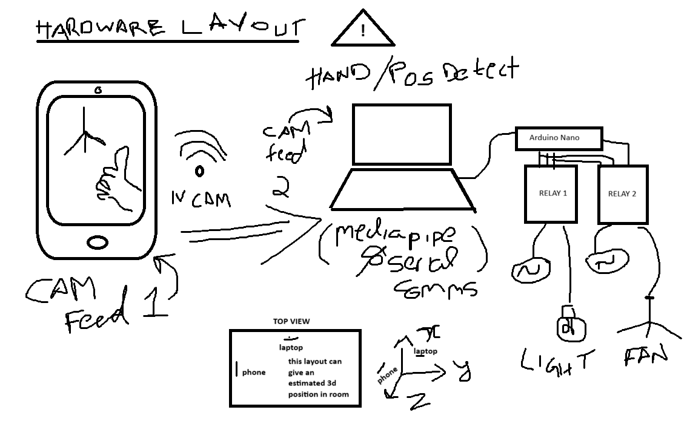

# Phalanx-Vectorized Bio-Kinetic Optoelectronic Modulation System (PV-BOMS)
---
### *Gesture Controlled Home Automation System*
--

### *Because sometimes, a normal light switch is just "fun".*

Ever wanted to tell your room to "shut up" or "lighten up" without saying a word? This project combines high-tech computer vision with low-brow social gestures to give you the ultimate power over a single LED.

---

## 📸 Proof of Concept

<div align="center">
  
  <p><i>The "Advanced" Dashboard</i></p>
  
  <br>

  <a href="https://youtu.be/yfnHCQr3u4U">
    
  </a>
  <p><i>[Click here to watch the demo on YouTube](https://youtu.be/yfnHCQr3u4U)</i></p>
  <p><i>C-TRACKER</i></p>
</div>

---

## 🤔 What is this?

The **PV-BOMS** is a state-of-the-art **Spite-Based Automation System**. Utilizing **Heuristic Phalangeal Landmark Vectorization** via **MediaPipe** and **OpenCV**, it performs real-time spatial analysis of hand geometry. When the system identifies a specific vertical phalanx-vector orientation (informally known as "The Nadu Viral (malayalam)"), it triggers an asynchronous serial signal to an **Arduino** which powers a relay to modulate the photonic output of a semiconductor diode (the LED) & the rotational propulsion of a brushless motor.

### Why?
- **Efficiency**: Why walk 3 steps to a switch, hassle with it when you can flip it off from your desk?
- **Catharsis**: Release your daily frustration while staying productive.
- **Science**: We are quantitatively analyzing the Euclidean ratio of the middle phalangeal tip relative to the metacarpophalangeal base. It's essentially a PhD thesis in kinetic social commentary.

---

## 🛠️ The Tech Stack

- **Python 3.x**: The brains.
- **OpenCV**: To see your frustration.
- **MediaPipe**: To calculate exactly how much you mean it.
- **Arduino**: The muscle.

---

## 🚀 How to Launch the Spite-Box

1.  **Hardware**: Plug your Arduino into `COM7`(hardwired). Make sure an Light relay is on Pin 11 & Fan relay on 12.
2.  **Dependencies**:
    ```bash
    pip install opencv-python mediapipe pyserial numpy
    ```
3.  **Flash the Arduino**: Upload `hardware_Sketch/ard.ino` to your board.
4.  **Engage**: Ensure hardware connections, ivcam(if used) & proceed to point of no return.
    ```bash
    python capture.py
    ```
5.  **Gesture**: You know what to do. 🖕

---

## ⚠️ Safety Warning

- **Do not** :use this during Zoom calls with your boss.
- **Caution** :use at your own risk.
- **Risk** :the image recognition software for fan & light,3d mo-cap has been removed due to risk of frying your potato.
- The system has a **1-second cooldown** to prevent accidental "strobe-light-of-rage" effects.

---

*Created with ❤️ by jimbru.*
